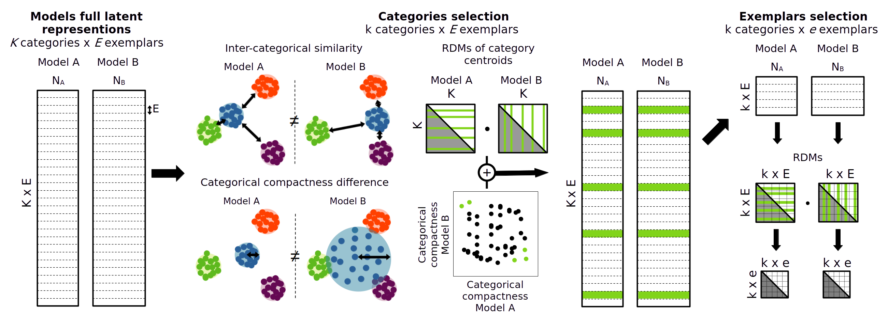
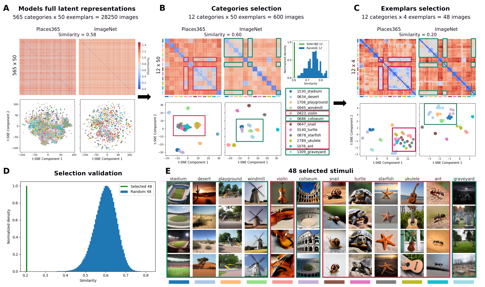

# repscreen: model-guided stimulus curation

[](https://github.com/PeerHerholz/representational-screening/actions)
[](https://github.com/PeerHerholz/representational-screening/blob/main/LICENSE)

`repscreen` curates stimuli that expose where two deep vision models
disagree. Given each model's activations over a large,
category-structured image set, it selects a small set of categories
the two models represent differently, then selects the exemplars
within those categories that maximise the divergence, quantified from
the models' representational geometries.

The resulting stimuli are few enough to run in a behavioural or
neuroimaging experiment while still separating the models, which makes
the comparison interpretable and theory-driven rather than a single
aggregate similarity score.



Collaborators: Leonard van Dyck, Alban Flachot (shared first
authorship) and Katharina Dobs.

Van Dyck, L., Flachot, A. and Dobs, K. (in preparation) Model-guided
stimulus curation for comparing artificial and biological vision.

## Installation

```bash
git clone https://github.com/PeerHerholz/representational-screening.git
cd representational-screening
uv pip install -e .
```

Optional extras: `".[dev]"` for the test and lint tools, `".[docs]"`
for the documentation build.

## Input layout

`repscreen` starts from activations that are already saved, so the
models themselves are never loaded. For each of the two models, record
one activation vector per image, typically from the penultimate layer,
and write them next to the image list they came from:

```
activations/
  places365/
    activations.npy     # shape (n_images, n_features)
    imagepaths.txt      # one path per image, same order
  imagenet/
    activations.npy
    imagepaths.txt
```

Both models must have seen the same images in the same order. The
directory holding an image names its category, every category must
contribute the same number of exemplars, and a category's images must
form one contiguous block.

## Usage

From Python:

```python
from repscreen.config import (
    ActivationConfig, OutputConfig, ScreeningConfig, SelectionConfig,
)
from repscreen.screening.pipeline import run_screening

config = ScreeningConfig(
    activations=ActivationConfig(
        activation_dir="data/activations",
        models=("places365", "imagenet"),
        dataset_path="data/dataset",
    ),
    selection=SelectionConfig(n_categories=12, n_exemplars=4),
    output=OutputConfig(output_dir="results"),
)

result = run_screening(config)
print(result.selected_category_names)
print(result.similarity)
```

Or from the command line:

```bash
repscreen --activation-dir data/activations \
          --models places365 imagenet \
          --dataset-path data/dataset \
          --output-dir results \
          --figure-dir figures
```

`repscreen --help` lists every argument.

## What it provides

| Module | What it covers |
| --- | --- |
| `repscreen.config` | Validated configuration for a screening run |
| `repscreen.data` | Loading paired activations and their category structure |
| `repscreen.metrics` | Dissimilarity matrices, nine compactness measures, centred kernel alignment |
| `repscreen.screening` | The category and exemplar stages, the pipeline, and null distributions |
| `repscreen.output` | Writers for NumPy, JSON and CSV results |
| `repscreen.plotting` | RDM pairs, compactness curves, t-SNE comparisons, stimulus grids |
| `repscreen.signatures` | Per-category Fourier spectra and CIELab chromaticity |
| `repscreen.cli` | The `repscreen` command |

## GenSet: a stimulus pool

We generated a large-scale, category-structured image dataset (GenSet)
using a latent diffusion model, balancing experimental control with
natural appearance. GenSet was based on the test set of EcoSet and
includes 565 categories and 28250 images. A link for downloading
GenSet will be made available upon acceptance.

## Results

The figure below comes from screening a ResNet trained on Places365
against a ResNet trained on ImageNet, which is also the comparison the
paper reports.



## Documentation

The full documentation, including the examples gallery, is built with

```bash
uv pip install -e ".[docs]"
cd docs && make clean html
```

## Development

```bash
uv run pytest                                      # tests
uv run flake8 repscreen/ tests/ tools/ examples/   # style
uv run codespell                                   # spelling
cd docs && make clean html                         # docs
```

All four are run by GitHub Actions on every push and pull request.
